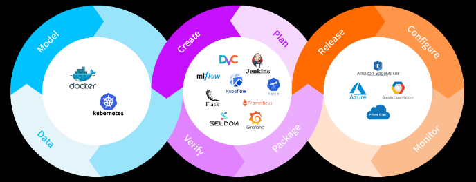

# study-mlops
Description and Summary of the use of the MLOps

## 1. mlops concept summary
- summary_mlops_tutorial_byeonseongyoon.md : 개발자 변성윤님의 mlops 입문 자료 요약
- summary_mlops_tutorial_microsoft_hansukjin.md : 마이크로소프트 AZURE 개발자 한석진님의 mlops 입문 자료 요약

## 2. mlops 구축
- 패스트 캠퍼스의 <머신러닝 서비스 구축을 위한 실전 MLOps> 기반 실습 정리
   - docker
   - kubernetes
   - dvc
   - mlflow
   - kubeflow
   - katib
   - seldoncore
   - grafana
   - prometheus
   - CI/CD Pipeline
      - github action
      - jenkins
      - Azure
      - GCP
