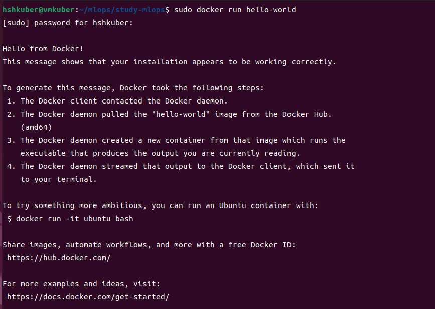
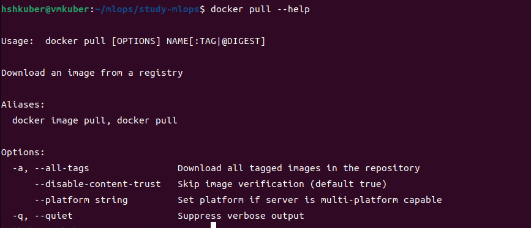
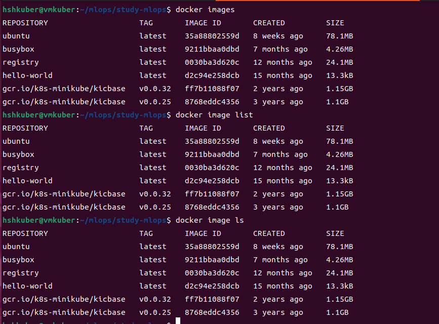
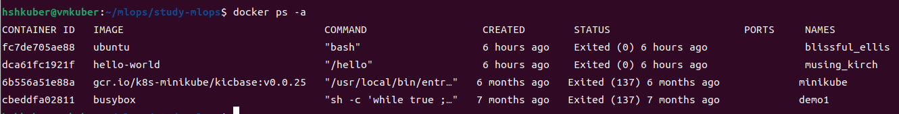

# Docker 정리

## 1. 설치
- docker 공식 문서 : https://docs.docker.com/engine/install/ubuntu/
   - docker engine을 설치하는 방식은 여러가지가 있음
- apt repository를 사용해서 설치하는 방식
   - docker engine을 설치하기 전에 docker 저장소(repository)를 설정해야함
   - 그 후 레포지토리에서 docker를 설치하고 업데이트 한다.
- apt 패키지 업데이트 기본 : sudo apt-get update
   - root 유저 아닌 host 기본 유저도 docker 권한 추가해야 sudo 명령어 안 쓰고 사용가능

### 1) facamp 방식
- 과거 버전이지만 사용가능
- prerequisite packge install
```
$ sudo apt-get install \
   apt-transport-https \
   ca-certificates \
   curl \
   gnupg \
   lsb-release
```

- docker의 CPG key 추가
```
$ curl -fsSL https://download.docker.com/linux/ubuntu/gpg | sudo gpg --dearmo r -o /usr/share/keyrings/docker-archcive-keyring.png
```

- gpg 키가 stable버전의 레포지토리를 바라보도록 설정
```
$ echo \
  "deb [arch=amd64 signed-by=/usr/share/keyrings/docker-archive-keyring.gpg] https://download.docker.com/linux/ubuntu \
  $(lsb_release -cs) stable" | sudo tee /etc/apt/sources.list.d/docker.list > /dev/null
```

- docker engine 설치
```
$ sudo apt-get install docker-ce docker-ce-cli containerd.io docker-buildx-plugin docker-compose-plugin
```

- 설치 후 정상 작동 확인
   - hello-world 라는 docker image를 다운로드하여 컨테이너에서 실행한다. 
   - docker engine 시작
```
$ sudo docker run hell-world
```


### 2) docker docs
- docker.docs 페이지의 최신 버전
- Set up Docker's apt repository.
```
# Add Docker's official GPG key:
sudo apt-get update
sudo apt-get install ca-certificates curl
sudo install -m 0755 -d /etc/apt/keyrings
sudo curl -fsSL https://download.docker.com/linux/ubuntu/gpg -o /etc/apt/keyrings/docker.asc
sudo chmod a+r /etc/apt/keyrings/docker.asc

# Add the repository to Apt sources:
echo \
  "deb [arch=$(dpkg --print-architecture) signed-by=/etc/apt/keyrings/docker.asc] https://download.docker.com/linux/ubuntu \
  $(. /etc/os-release && echo "$VERSION_CODENAME") stable" | \
  sudo tee /etc/apt/sources.list.d/docker.list > /dev/null
sudo apt-get update
```

- install the docker packages
```
$ sudo apt-get install docker-ce docker-ce-cli containerd.io docker-buildx-plugin docker-compose-plugin
```

- running hello-world image
```
$ sudo docker run hello-world
```

## 2. docker 명령어들
- 명령어의 기능을 모를때는 help
```
 [명령어] --help
```

### 1) docker pull
- image repository에서 docker image를 다운로드 하는 명령어
   - public repository가 아닌 private한 repository에서 image를 받으려면 해당 repository를 바라보게(환경설정)한 뒤 docker pull을 해야 함
```
$ docker pull
```


### 2) docker images
- image 리스트 출력 명령어
```
docker images, docker image list, docker image ls 
```


### 3) docker container
- 실행중인 docker container 리스트 출력
   - docker ps -a : 모든 컨테이너 출력 (실행중이 아닌 것들 포함)
   - docker ps -a -s : 모든 컨테이너의 size도 출력 
   - docker ps 만 입력하면 실행중인 컨테이너가 없을 경우 아무것도 출력 되지 않는다.
```
$ docker ps -a
```



