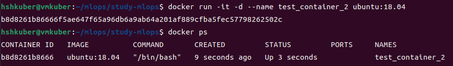
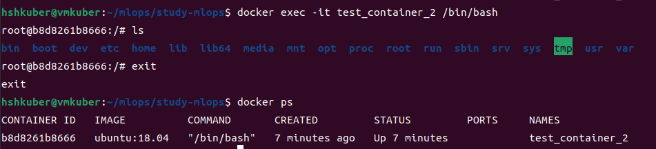
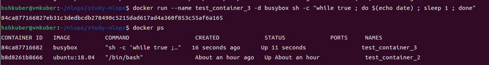
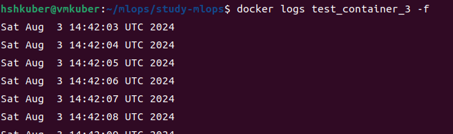
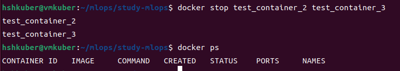
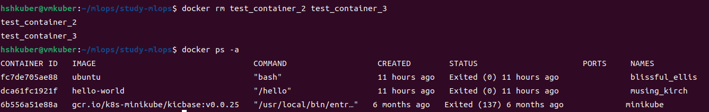
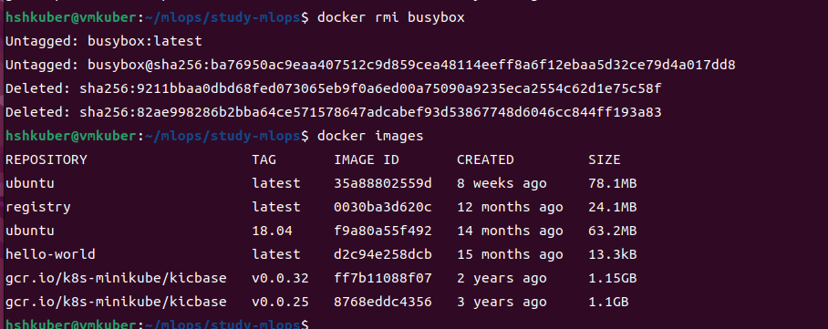

# Docker 정리

## 1. 설치
- docker 공식 문서 : https://docs.docker.com/engine/install/ubuntu/
   - docker engine을 설치하는 방식은 여러가지가 있음
- apt repository를 사용해서 설치하는 방식
   - docker engine을 설치하기 전에 docker 저장소(repository)를 설정해야함
   - 그 후 레포지토리에서 docker를 설치하고 업데이트 한다.
- apt 패키지 업데이트 기본 : sudo apt-get update
   - root 유저 아닌 host 기본 유저도 docker 권한 추가해야 sudo 명령어 안 쓰고 사용가능

### 1) facamp 방식
- 과거 버전이지만 사용가능
- prerequisite packge install
```
$ sudo apt-get install \
   apt-transport-https \
   ca-certificates \
   curl \
   gnupg \
   lsb-release
```

- docker의 CPG key 추가
```
$ curl -fsSL https://download.docker.com/linux/ubuntu/gpg | sudo gpg --dearmo r -o /usr/share/keyrings/docker-archcive-keyring.png
```

- gpg 키가 stable버전의 레포지토리를 바라보도록 설정
```
$ echo \
  "deb [arch=amd64 signed-by=/usr/share/keyrings/docker-archive-keyring.gpg] https://download.docker.com/linux/ubuntu \
  $(lsb_release -cs) stable" | sudo tee /etc/apt/sources.list.d/docker.list > /dev/null
```

- docker engine 설치
```
$ sudo apt-get install docker-ce docker-ce-cli containerd.io docker-buildx-plugin docker-compose-plugin
```

- 설치 후 정상 작동 확인
   - hello-world 라는 docker image를 다운로드하여 컨테이너에서 실행한다. 
   - docker engine 시작
```
$ sudo docker run hell-world
```


### 2) docker docs
- docker.docs 페이지의 최신 버전
- Set up Docker's apt repository.
```
# Add Docker's official GPG key:
sudo apt-get update
sudo apt-get install ca-certificates curl
sudo install -m 0755 -d /etc/apt/keyrings
sudo curl -fsSL https://download.docker.com/linux/ubuntu/gpg -o /etc/apt/keyrings/docker.asc
sudo chmod a+r /etc/apt/keyrings/docker.asc

# Add the repository to Apt sources:
echo \
  "deb [arch=$(dpkg --print-architecture) signed-by=/etc/apt/keyrings/docker.asc] https://download.docker.com/linux/ubuntu \
  $(. /etc/os-release && echo "$VERSION_CODENAME") stable" | \
  sudo tee /etc/apt/sources.list.d/docker.list > /dev/null
sudo apt-get update
```

- install the docker packages
```
$ sudo apt-get install docker-ce docker-ce-cli containerd.io docker-buildx-plugin docker-compose-plugin
```

- running hello-world image
```
$ sudo docker run hello-world
```

## 2. docker 명령어들
- 명령어의 기능을 모를때는 help
```
 [명령어] --help
```

### 1) docker pull
- image repository에서 docker image를 다운로드 하는 명령어
   - public repository가 아닌 private한 repository에서 image를 받으려면 해당 repository를 바라보게(환경설정)한 뒤 docker pull을 해야 함
```
$ docker pull
```


### 2) docker images
- image 리스트 출력 명령어
```
docker images, docker image list, docker image ls 
```


### 3) docker container
- 실행중인 docker container 리스트 출력
   - docker ps -a : 모든 컨테이너 출력 (실행중이 아닌 것들 포함)
   - docker ps -a -s : 모든 컨테이너의 size도 출력 
   - docker ps 만 입력하면 실행중인 컨테이너가 없을 경우 아무것도 출력 되지 않는다.
```
$ docker ps -a
```


### 4) docker run
- docker 컨테이너 실행 명령어
   - docker run [option] image [command] [ARG...]
   - 다양한 option 들이 있다.
   - docker run -it --name demo1 ubuntu:18.04 /bin/bash
      - ubuntu:18.04라는 컨테이너를 실행함
      - -i + -t : 컨테이너를 실행할 때 interactive한 terminal로 접속
      - --name : 이 컨테이너의 id 대신에 별칭을 적용
      - /bin/bash : 컨테이너를 실행할 커맨드로 bash 터미널을 사용
- image가 컨테이너에서 실행됨 : container id에 해당하는 컨테이너에서 image가 실행됨
```
$ docker -it --name test_container ubuntu:18.04 /bin/bash
```
<imr src="./images/docker_run_container.png">

### 5) docker exec
- docker container 내부에서 사용하는 명령어
   - docker run image 로 실행을 하면 docker container 내부로 접속한다.
      - 이러한 경우 container 내부에서 나오면(exit) container도 종료된다.
      - docker run 에서 option 으로 -d를 사용하면, 백그라운드에서 컨테이너가 계속 실행된다.
      - 이때 docker exec를 입력하면 해당 컨테이너 내부로 접속할 수 있다.
- container 내부에서 사용하는 실행 명령어 또는 container 내부로 접속하는 명령어
   - container 내부에 접속하여 image 등을 실행시킬 수 있다.

#### 백그라운드에서 container 실행
- test_container_2 container가 실행중으로 나온다
```
$ docker run -it -d -name test_container_2 ubuntu:18.04
$ docker ps 
```


#### exec 명령어로 실행 중인 container 내부로 접속
- 옵션 -d를 사용하지 않고 run을 하면 container 내부로 바로 접속되고, 내부에서 나오면 container가 종료된다. 옵션 -d를 사용하여 run을 하면 백그라운드에서 container가 실행되고 exec를 사용하여 내부에 접속하고 내부에서 나오더라도 container가 실행중이다.
```
$ docker exec -it test_container_2 /bin/bash
```


### 6) docker log
- docker 컨테이너의 로그 확인
   - docker logs [option] container 

#### 반복문 실행하는 컨테이너 만들기
- docker run --name test_container_3 -d busybox sh -c "while true; do $(echo date); sleep 1; done"
   - test_container_3라는 이름의 컨테이너에서 busybox 이미지를 실행한다.
   - busybox 이미지는 1초간격으로 현재 date 를 출력하는 image 이다.
   - test_container_3 이 실행중인 것을 확인할 수 있다.
```
$ docker run --name test_container_3 -d busybox sh -c "while true ; do $(echo date) ; sleep 1 ; done"
```


#### 로그 확인 하기
- busybox container의 로그를 확인하면  컨테이너를 watch 하면서 시간을 출력한다.
   - cltr + c 로 시간 출력 중지
```
$ docker logs test_container_3 -f
```


### 7) docker stop
- 실행중인 container 중지
   - docker stop [options] containers
   - docker stop demo3 demo2 : demo3, demo2 컨테이너를 실행 중단함
```
$ docker stop test_container_2 test_container_3
```


### 8) docker rm
- docker container 삭제
   - docker rm [options] container [container...]
   - docker rm demo3 : demo3 이름의 컨테이너를 삭제함
   - 컨테이너를 삭제해도 image는 그대로 남아있다.
```
$ docker rm test_container_2 test_container_3
```


### 9) docker rmi
- docker image 삭제
   - docker rmi [options] image [image...]
   - image의 이름만 입력해도 삭제가 되지만, 이미지:tag 형식으로 입력해야 삭제될 때도 있다.

#### sleep 1 마다 date를 출력하는 busybox 이미지 제거
```
$ docker rmi busybox
```


## 3. docker의 image란?
- `docker image` : 어떤 애플리케이션(app, api, sevice)에 대해서 단순히 코드뿐만 아니라(소스 코드),애플리케이션과 dependent 한 모든 것을 함께 패키징한 데이터
   - **애플리케이션의 모든 것을 함께 패키징한 데이터**
- `docker file` : 도커 이미지를 쉽게 만들 수 있는 템플릿
   - FROM : base image 설정 
      - FROM <image>[:<tag>] [AS <name>]
      - FROM ubuntu, FROM ubuntu:18.04, FROM nginx:latest AS ngx
      - nginx는 플라스크나 장고에서 사용하는 웹서버 (정적 페이지 요청을 처리하기 위한 웹서버 중 하나)
   - COPY : <src>의 파일이나 디렉토리를 <dest> 경로에 복사
      - COPY <src>...<dest>
      - COPY a.txt /test-dir : a.txt 파일을 test-dir에 이름 그대로 복사
      - COPY a.txt /test-dir/b.txt : a.txt 파일을 test-dir에 b.txt로 복사
   - RUN : 도커 컨테이너에서 명시한 커맨드를 실행
      - RUN <command>
      - RUN ["executable-command", "parameter1", "parameter2"]
      - RUN pip install torch : pip에서 torch 패키지를 설치하도록 실행
      - RUN pip install -r requirement.txt : requirement.txt 파일의 패키지를 pip를 사용해 install 실행
   - CMD : 도커 컨테이너 시작 될 때 명시한 커맨드를 실행
      - ENTRYPOINT 명령어도 비슷한 기능 
      - 하나의 도커 이미지에서 하나의 CMD만 사용할 수 있음, RUN은 여러번 사용가능함
      - CMD <command>
      - CMD ["executable-command", "parameter1", "parameter2"]
      - ENTRYPOINT와 함께 사용시 : CMD ["parameter1", "parameter2"]
      - CMD python main.py : 컨테이너 시작 시 main.py 파일을 python으로 실행
   - WORKDIR : 어떤 명령어를 실행할 디렉토리 설정, 이 디렉토리가 없으면 생성함
      - WORKDIR <dir>
      - WORKDIR /home/docker-tutorial
   - ENV : 컨테이너 내부에서 지속적으로 사용될 environment variable의 값 설정
      - ENV <key> <value>
      - ENV <key>=<value>
      - ENV locale-gen ko_KR.UTF-8
      - ENV LANG ko_KR.UTF-8
      - ENV LANGUAGE ko_KR.UTF-8
      - ENV LC_ALL ko_KR.UTF-8
   - EXPOSE : 컨테이너에서 포트/프로토콜 지정, 디폴트는 TCP
      - EXPOSE <port>
      - EXPOSE <port>/<protocol>
      - EXOSE 8080
- FROM, RUN, COPY, COMMAND, WORKDIR, EXPOSE, ENV ...


