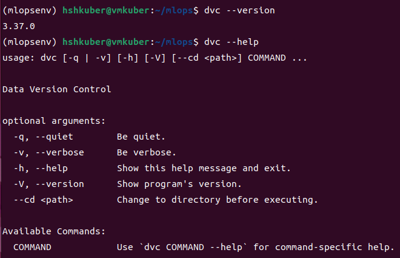
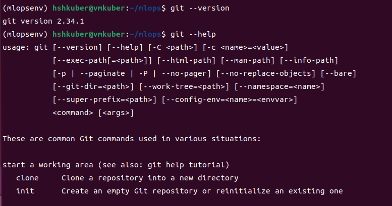
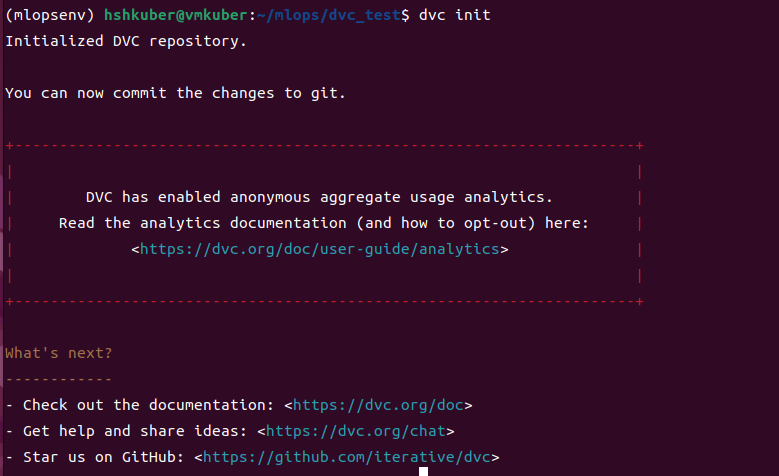
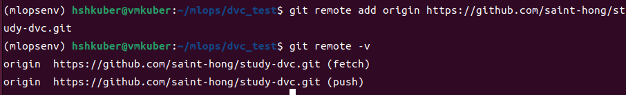
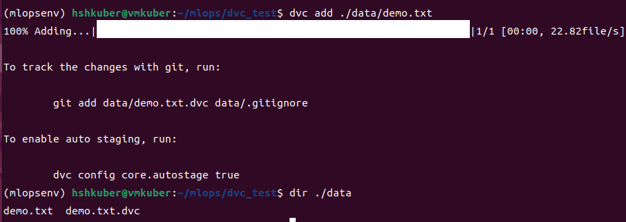
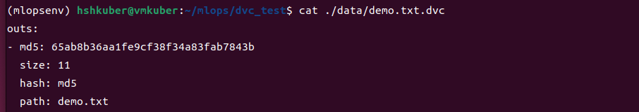

# DVC Summary
- dvc는 데이터 버전 컨트롤 오픈 소스
   - DVC : Data Version Controlled
   - www.dvc.org
- git과 함께 사용하며 원격스토리지를 연결할 수 있다.
   - git add, commit 후 dvc push

## 1. Install
- dvc 패키지와 git 을 설치한다.
- OS 환경에 맞는 설치 방법들이 있다.

### 1) dvc 설치
- pip 패키지 관리자를 사용하여 설치
   - conda 명령을 사용한 설치도 가능
- dvc에서 사용할 수 있는 원격스토리지 유형에 맞는 종속성을 함께 설치한다.
   - [all] : 모든 원격스토리지 유형 설치
   - 사용가능한 원격스토리지 : [s3], [gdrive], [gs], [azure], [ssh], [hdfs] 등
```
$ pip install dvc[all]
```

#### 설치 확인
- 버전 및 패키지 도움말 확인
```
$ dvc --version
$ dvc --help
```


### 2) git 설치
- git repository에 .dvc 파일을 push 하여 데이터 버전에 대한 트랙킹을 하기 위함
```
$ sudo apt install git
$ git --verion
$ git --help
```


## 2. dvc 저장소 셋팅
- 로컬에 디렉토리를 생성한 후 dvc, git을 초기화 한다.
   - .dvc, .git 파일이 생성된다.
   - git repository와 로컬의 디렉토리를 연결하기 위함.
   - .dvc 파일은 데이터의 버전관련 정보가 저장되어 있는 파일이다.
- git repository와 연결하여 .dvc 파일을 관리하고,
- 원격스토리지로 gdrive를 설정하여 실제 data 파일을 관리한다.

#### dvc 명령어 사용시 "permission denied" 에러 발생
- dvc를 제거한 후 재설치 해도 해결 안됨
- 새로운 conda 가상환경 만들고 재설치 하니 해결 됨

### 1) 디렉토리 생성 및 초기화
- git init을 먼저한 후 dvc init을 해야한다.
   - dvc가 실행되려면 git에 의존해야하는 것 같다.
```
$ mkdir dvc_test
$ git init
$ dvc init
```


### 2) git repository 연결
- dvc_test 디렉토리에서 생성된 dvc 파일을 관리할 git의 repository와 연결한다.
   - 방법 1 : 로컬에 디렉토리를 만든 후 레포지토리의 url을 추가
   - 방법 2 : repository를 git clone 하여 로컬에 디렉토리 생성
```
$ git remote add origin [repository url]
```


## 3. dvc 기본 사용

### 1) data tracking
- 트랙킹할 데이터 생성
```
$ mkdir data
$ touch ./data/demo.txt
$ vim ./data/demo.txt
$ cat ./data/demo.txt
> hello DVC!
```

### 2) dvc tracking
- 해당 디렉토리에 .dvc, .gitignore 파일이 생성된다.

```
$ dvc add ./data/demo.txt
$ dir ./data
```


#### dvc 트랙킹 파일 확인
- .dvc 파일에는 트랙킹할 파일에 대한 메타 정보들이 들어 있다.
- 이 .dvc 파일로 파일의 버전을 관리할 수 있다. 이전 버전으로 돌아갈 수 있다.
```
$ cat ./data/demo.txt.dvc
```


### 3) git repository에 add, commit, push
- repository에서 관리한 파일들을 push 한다.
```
$ git add ./data/demo.txt.dvc ./data/.gitignore
$ git commit -m "update dvc tracking files"
$ git push origin
```

### 4) dvc remote storage를 gdrive 셋팅
- dvc의 default remote storage를 구글 드라이브의 임시 폴더로 설정한다.
   - 구글 드라이브가 아닌 다른 저장소를 사용해도 됨
   - 구글 드라이브의 폴더의 아이디를 복붙한다.
- 디폴트 스토리지 설정을하면 .dvc의 config 파일이 자동으로 변동되고 이것을 git repository에 push 한다.
```
$ dvc remote add -d storage gdrive://<my folder ID>
$ git add .dvc/config
$ git commit -m "add remote storage : gdrive"
```


