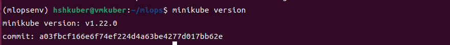

# Minikube 정리

## 1. minikube 설치
- 소규모 쿠버네티스를 사용하기 위해서 minicube 설치 필요
   - minicube의 최소 설치 vm 조건

### 1) minikube 환경 세팅
- 현재 사용하고 있는 virture machine의 스펙을 업그레이드 시켜줘야 한다.
   - kubernetes 관련 모든 패키지들을 설치하고 실행시키려면 환경의 스펙이 좋을 수록 원활하게 돌아감
   - CPU, Memory, Disk 등 vm의 환경 스펙을 본체 스펙과 잘 구분지어서 설정해야함
- 새 vm 생성
   - ISO image : ubuntu-22.04.3-desktop-amd6
   - 메모리 12gb, cpu 6
   - 용량 80gb
   - vmkuber
   - username : hshkuber
   - pw : hshkuber6547
- vm을 생성 후 스펙 조절 가능하다.

### 2) minikube 설치
- minikube의 버전이 중요하다. 이 버전에 따라서 여러가지 패키지들의 버전 연관성이 달라지게 된다
   - 최신 버전이라고 해서 좋은 것만은 아니다. minikube는 최신이지만 내가 사용하려는 다른 패키지와 호환이 안되면 이와 연관된 다른 패키지들도 원하는 데로 동작이 안될 수 있다.
   - 따라서 강의 당시 버전으로 설치한다.
   - v1.22.0
- minikube는 자유롭게 삭제하고 재설치 할 수 있다.

#### minikube 바이너리 다운로드
- 버전은 교육 과정과 같은 v1.22.0으로 다운로도 한다.
- 현재 위치에 amd64 설치 파일이 다운로드 된다.
   - 이 파일을 지우지 않는 이상 minikube를 삭제후에 다시 설치 할 수 있다.
```
$ curl -LO https://storage.googleapis.com/minikube/releases/v1.22.0/minikube-linux-amd64
```

#### 바이너리 파일 설치
- /usr/local/bin/ 디렉토리에 minikube를 설치한다.
- 이외에도 kubectl, helm 등 여러 실행 프로그램들을 이 위치에 설치한다.
```
$ sudo install minikube-linux-amd64 /usr/local/bin/minikube
```

#### minikube 삭제 시
- minikube delete로 삭제 후,
- /usr/local/bin/ 에 설치한 minikube를 직접 제거한다.(sudo rm minikube)

### 3) kubectl 설치
- kubectl : kubernetes cluster(server)에 요청을 간편하게 보내기 위해서 널리 사용되는 client 툴
   - 설치 후 정상 작동 확인
- kubernetes 환경을 사용하기 위한 kubectl의 다양한 명령어들이 있다.
   - kubernetes의 여러 자원과 다양한 패키지들이 실행되면 명령어의 길이도 길어지게 되는데, kubectl의 기능을 사용하면 이러한 번거로움을 줄일 수 있다.

#### 설치
- 바이너리 설치 파일 다운로드
```
$ curl -LO https://dl.k8s.io/release/v1.22.1/bin/linux/amd64/kubectl
```
-설치 및 권한과 위치 변경
```
$ sudo install -o root -g root -m 0755 kubectl /usr/local/bin/kubectl
```

#### 설치 확인
- help
```
$ kubectl --help
```


- 버전 확인
   - kubectl의 버전은 client 버전과 kubernetes server 버전이 있고 이 두개가 출력된다. 하지만 kt server을 생성하지 않은 경우 client 버전만 출력된다.
```
$ kubectl version
```


####  kubectl 사용하여 minikube 내부의 default pod 들이 정상적으로 생성되었는지 확인
- minikube 실행에 필요한 pod 확인
```
$ kubectl get pod -n kube-system   
```
### 4) minikube, kubectl 설치 후 정상 작동 확인

#### minikube 설치 됐는지 확인하는 기본 명령어
```
$ minikube --help
$ minikube version
```



#### minikube 시작
- start 뒤에 여러가지 option 들을 추가할 수 있다.
   - --driver=docker : docker 기반으로 minikube 시작
```
$ minikube start --driver=docker 
```


#### minikube 시작상태 확인
- type, host, kubelet, apiserver, kubeconfig 기능이 실행 되어야 minikube가 정상 작동함 
```   
$ minikube status
```


#### minikube 중지
- minikube 클러스터를 중지함
```
$ minikube stop
```


